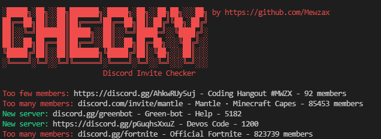

<h1 align="center">Checky But Free</h1>
<p align="center">

</p>

<h4 align='center'>💰 a free alternative of the tool by genefit</h4>

## Preview



## Warning

My tool is probably more slow than genefit tool (but imagine paying 5$ for a checker lol)

I never tried the genefit tool but I know how it works so I did this

Maybe original Checky is writen in Golang, but mine is in Python

## Features

- Checks Invite name, and members
- Store the invites if there are corrects
- Proxies support

## Todo

- [ ] merge my [generator](https://github.com/Mewzax/Discord-Invite-Generator) with this repo

## Built with

- [httpx](https://www.python-httpx.org)
- [colorama](https://pypi.org/project/colorama/)

## Requirements

- [Python](https://www.python.org/downloads/)
- Proxies (optional)

## Installation

```t
# Clone the repo:
git clone https://github.com/Mewzax/Checky-Free
cd Checky-Free

# Install packages
pip install -r requirements.txt

# Run the code
python3 main.py
```

<p align="center"> 
    <b>Informations</b><br>
    
    
    
</p>
